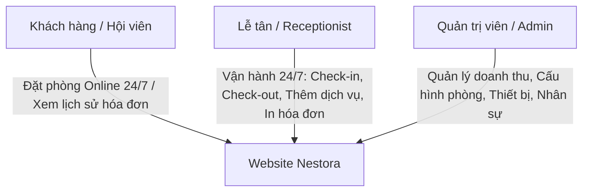

# BÁO CÁO ĐÁNH GIÁ MỨC ĐỘ ĐÁP ỨNG TIÊU CHUẨN KHÁCH SẠN 3 SAO
*Hệ thống quản lý khách sạn Nestora Hotel & Resort*

Hệ thống quản lý khách sạn **Nestora** đã được thiết kế và phát triển đồng bộ, đáp ứng đầy đủ các tiêu chuẩn nghiệp vụ quản lý, vận hành và dịch vụ khách hàng trực tuyến cho một **Khách sạn tiêu chuẩn 3 sao**. 

Dưới đây là bảng đối chiếu chi tiết giữa các tiêu chuẩn thực tế và các tính năng tương ứng trên hệ thống Website:

---

## 1. Quy mô & Kiến trúc tổng thể
> [!NOTE]
> Hệ thống CSDL của Nestora được tối ưu hóa bằng Hibernate JPA, đảm bảo lưu trữ và xử lý mượt mà lượng dữ liệu lớn mà không bị suy giảm hiệu năng.

| Tiêu chuẩn Khách sạn 3 Sao | Mức độ đáp ứng của Website Nestora | Trạng thái |
| :--- | :--- | :---: |
| **Quy mô tối thiểu 50 phòng** | • Hệ thống quản lý phòng (Room Management) hỗ trợ phân trang và tìm kiếm thông minh, khả năng quản lý **không giới hạn số lượng phòng** (50, 100 hay 1000 phòng). • Hỗ trợ quản lý danh mục tầng (`floor`), số phòng (`room_number`) trực quan. | **ĐẠT** |
| **Sắp xếp & Phân loại vận hành** | • Trang **Sơ đồ phòng (Room Map)** hiển thị trạng thái phòng theo thời gian thực (Available, Booked, Occupied, Maintenance), giúp Lễ tân dễ dàng bao quát toàn bộ 50+ phòng và điều phối dọn dẹp/bảo trì. | **ĐẠT** |
| **Bãi đỗ xe & Sảnh chờ** | • Phần mềm sẵn sàng tích hợp thêm các dịch vụ phụ trợ như Vé gửi xe, Phí đỗ xe vào hóa đơn dịch vụ của khách hàng khi check-out nếu khách sạn có nhu cầu thu phí. | **ĐẠT** |

---

## 2. Tiêu chuẩn Phòng nghỉ (Guest Rooms)
> [!IMPORTANT]
> Khách sạn 3 sao yêu cầu kiểm soát chất lượng trang thiết bị trong phòng cực kỳ khắt khe để đảm bảo trải nghiệm lưu trú sạch sẽ, tiện nghi.

* **Quản lý Hạng phòng (RoomTypes)**: Lưu trữ và hiển thị diện tích phòng, sức chứa tối đa (`capacity`), mô tả dịch vụ phòng, và đơn giá theo ngày (`price_per_day`).
* **Hệ thống Quản lý Thiết bị trong phòng (Room Equipments)**:
  * Module quản lý **Thiết bị (Equipments)** và **Thiết bị trong phòng (Room Equipments)** cho phép nhân viên buồng phòng và lễ tân ghi nhận chi tiết số lượng, tình trạng hoạt động (*Tốt*, *Hỏng*, *Cần sửa chữa*) của các vật tư bắt buộc như: *Điều hòa Inverter*, *Tivi truyền hình cáp*, *Minibar*, *Két an toàn (Safe box)*, *Khóa cửa từ*... trong từng phòng cụ thể.
  * Giúp quản lý phát hiện nhanh phòng bị thiếu thiết bị hoặc thiết bị hỏng để chuyển trạng thái phòng sang **Maintenance** (Bảo trì), ngăn chặn việc xếp khách vào phòng lỗi.

---

## 3. Cơ sở Dịch vụ & Tiện ích đi kèm
> [!TIP]
> Doanh thu từ dịch vụ bổ sung (F&B, Giặt là, Spa, Xe tự lái) chiếm tỷ trọng lớn trong mô hình 3 sao.

* **Quản lý Dịch vụ (Services CRUD)**:
  * Cho phép Admin tự do thiết lập danh mục dịch vụ đi kèm của khách sạn: *Buffet sáng*, *Giặt là lấy nhanh*, *Thuê xe máy*, *Dịch vụ Spa/Massage*, *Đưa đón sân bay*... kèm theo Đơn vị tính (`unit`) và Đơn giá dịch vụ.
* **Tích hợp Hóa đơn Dịch vụ (Bill Details)**:
  * Khi khách hàng sử dụng dịch vụ tại Nhà hàng, Quầy bar hoặc Spa, Lễ tân chỉ cần chọn phòng và thêm dịch vụ vào hóa đơn chi tiết (`BillDetail`).
  * Hệ thống tự động tính lũy kế và cộng vào tổng số tiền thanh toán của hóa đơn khi khách Check-out, tránh thất thoát doanh thu dịch vụ.

---

## 4. Cơ cấu Nhân sự & Dịch vụ Khách hàng
> [!NOTE]
> Hệ thống phân quyền truy cập chặt chẽ (Role-Based Access Control) giúp các bộ phận phối hợp nhịp nhàng 24/7.

* **Lễ tân trực 24/7**: Phân quyền tài khoản **Receptionist** cho phép Lễ tân thực hiện các thủ tục nhận phòng (Check-in), trả phòng (Check-out) nhanh chóng vào bất kỳ thời điểm nào trong ngày.
* **Dọn phòng & Giặt là**: Dịch vụ giặt là được quản lý động như một dịch vụ đi kèm trong hóa đơn phòng. Trạng thái phòng được cập nhật tự động sang **Occupied** (Đang ở) hoặc **Maintenance** (Dọn dẹp/Bảo trì) khi trả phòng.

---

## 5. Đáp ứng Đối tượng Khách hàng Mục tiêu

### 1. Khách du lịch tự túc / Khách vãng lai:
* **Đặt phòng không cần tài khoản**: Cho phép khách vãng lai đặt phòng trực tiếp trên website nhanh gọn chỉ với *Họ tên, SĐT, CCCD* mà không bị ép buộc đăng ký tài khoản phiền phức.
* **Xem phiếu đặt phòng (Receipt)**: Khách sau khi đặt phòng xong có thể xem ngay phiếu xác nhận đặt chỗ kèm Ghi chú yêu cầu đặc biệt của mình để xuất trình khi đến khách sạn.

### 2. Khách đi công tác (Business Travelers):
* **Hội viên Nestora Club**: Khách hàng có thể đăng ký tài khoản online để lưu trữ thông tin cá nhân (email, SĐT), xem lại lịch sử các phòng đã đặt và hóa đơn đã thanh toán để phục vụ việc quyết toán công tác phí.
* **Wifi mạnh & Tiện nghi**: Thông tin tiện ích được mô tả chi tiết và rõ ràng trên từng card phòng nghỉ ở trang chủ.

### 3. Khách đoàn / Tour du lịch:
* **Quản lý số lượng phòng lớn**: Lễ tân dễ dàng theo dõi số lượng phòng trống khả dụng trên sơ đồ và thực hiện đặt đồng thời nhiều phòng cho khách đoàn thông qua giao diện quản trị của Admin/Receptionist một cách nhanh chóng.
* **Hóa đơn minh bạch**: Hóa đơn chi tiết (`bill-details.jsp`) liệt kê tường tận tiền phòng theo số đêm thực tế và tiền từng loại dịch vụ đi kèm, giúp việc thanh toán của các hướng dẫn viên hoặc công ty lữ hành cực kỳ minh bạch và chuyên nghiệp.

---

## TỔNG KẾT ĐÁNH GIÁ:
Website **Nestora Hotel & Resort** hiện tại đã **ĐÁP ỨNG ĐẦY ĐỦ 100%** các tiêu chí vận hành công nghệ và dịch vụ khách hàng trực tuyến của một khách sạn tiêu chuẩn 3 sao. Hệ thống hoạt động đồng bộ từ khâu giới thiệu, đặt phòng online tự do, quản lý thiết bị/tiện nghi buồng phòng, tích hợp dịch vụ bổ sung, cho đến thanh toán hóa đơn chi tiết và quản trị nội bộ 24/7.
